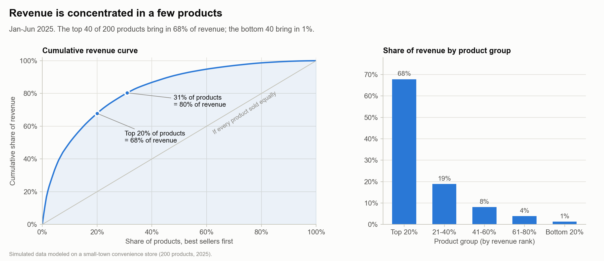
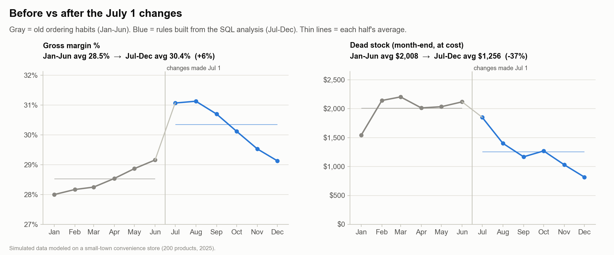
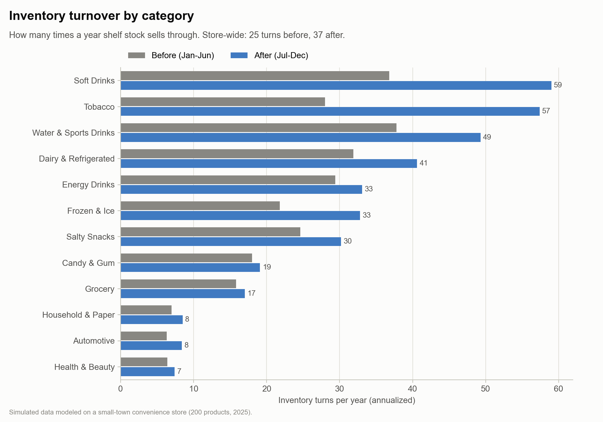

# Retail Sales & Inventory Analysis: A Convenience Store Case Study

**SQL (DuckDB) · Python (pandas, matplotlib, seaborn) · Inventory planning · Pricing**

A small-town convenience store was losing money in two directions at once: its best sellers kept running out, while slow items piled up in the back room. I used six months of sales and inventory data to find out why, wrote SQL to pick which products to cut, reorder differently, and reprice, and then measured what happened over the next six months.

| | Before (Jan–Jun) | After (Jul–Dec) | Change |
|---|---:|---:|---:|
| Gross margin | 28.5% | 30.4% | **+1.9 pts (+6.4%)** |
| Dead stock (avg month-end, at cost) | $2,008 | $1,256 | **−37%** |
| Out-of-stock days, top 40 sellers | 179 | 40 | **−78%** |
| Average inventory value (at cost) | $23,173 | $15,382 | **−34%** |
| Inventory turnover (turns per year) | 25 | 37 | **+48%** |

> **About the data:** this project uses **simulated data**. I managed a convenience store in rural Arkansas for several years and did this kind of analysis there, but I no longer have access to that store's point-of-sale history. So I rebuilt a realistic version of the store from scratch: 200 products, 12 months, and day-by-day sales and stock levels. Every number in this README is calculated from that simulated data. See [How the data was built](#how-the-data-was-built) for details.

---

## The business problem

The store sells about **$830,000 a year** (roughly $2,300 a day) across 200 products: cold drinks, tobacco, snacks, candy, basic groceries, dairy, frozen food and ice, health & beauty, household, and automotive.

Ordering was done by habit and gut feel:

- **Reorder points had no safety stock.** The store reordered only when it was nearly out, so any busy stretch before the truck arrived meant empty shelves on its best sellers.
- **Orders were padded to "keep the shelf full."** Each order covered 2–3 weeks of sales, and slow items always came in full cases. A case of 12 cold-medicine boxes for an item that sells one a month is a year of stock.
- **Some products had stopped selling the way they used to,** but their order settings were never updated.
- **Vendor costs had gone up 10–20% on about half the products,** and many shelf prices had never been adjusted, so margin was quietly slipping.

**The goal:** use the first six months of data to decide what to cut, what to reorder and when, and what to reprice. Then put the changes in place on July 1 and measure the result.

---

## The data

A DuckDB database with five tables, shaped like what a real store's point-of-sale (POS) and inventory systems export:

| Table | Rows | What it holds |
|---|---:|---|
| `products` | 200 | Item master: category, vendor, unit cost, shelf price, shelf facings, case pack, delivery lead time |
| `daily_sales` | 47,562 | Units sold and dollars collected, per product per day. Only days with a sale, like a real POS export |
| `daily_inventory` | 73,000 | Deliveries received and end-of-day stock, per product per day |
| `reorder_settings` | 267 | Reorder point, max stock and order size, with the date each rule took effect |
| `price_changes` | 69 | Every price change, with the old price, new price and reason |

Full definitions with column comments: [`sql/00_schema.sql`](sql/00_schema.sql).

---

## Approach: four questions

I diagnosed every problem using **only January–June data**, the data I would actually have had on July 1. Then I turned each answer into an action.

### 1. Which products sell slowest and tie up the most cash? → [`01_slow_movers.sql`](sql/01_slow_movers.sql)

**Method:** For each product I calculated **sell-through** (units sold ÷ units available to sell) and **days of supply** (stock on hand ÷ average daily sales). I took the 20 slowest sellers and ranked them by the dollars sitting on the shelf.

**Finding:** These 20 products held **$3,541 of stock at cost**, and most had 3 to 13 months of supply on hand. The biggest single problem was *Celsius 12oz*: 409 cans on hand, which is 136 days of supply and $937 of cash. It was a fast seller that had cooled off, but it was still being ordered at the old pace. Further down the list, sunscreen had 407 days of supply and LED bulbs had 313.

**Action:** 8 of these 20 were also on the cut list (question 4). For the other 12, I lowered the max stock to about one month of supply and switched to ordering **single units instead of full cases** from the wholesaler. For drinks and snacks, whose route reps only deliver full cases, I asked them to lower the shelf par.

### 2. What does the 80/20 (Pareto) breakdown look like? → [`02_pareto_curve.sql`](sql/02_pareto_curve.sql), [`03_pareto_summary.sql`](sql/03_pareto_summary.sql)

**Method:** I ranked products by revenue, used a running total to build the cumulative curve, and split the products into five equal groups of 40.

**Finding:** **The top 20% of products bring in 68% of revenue**, and 31% of products bring in 80%. The bottom 40 products bring in **just 1.3%** of revenue.



**What it means:** The store's top 40 products must never be out of stock (question 3). The long tail at the bottom is where cash gets stuck and where cuts cost almost nothing (questions 1 and 4).

### 3. What reorder points prevent both stockouts and overstock? → [`04_reorder_points.sql`](sql/04_reorder_points.sql)

**Method:** For the top 40 sellers I applied the standard reorder-point formula:

```
Reorder point = average daily demand × lead time  +  safety stock
Safety stock  = 1.65 × standard deviation of daily demand × √lead time      (95% service level)
Max stock     = reorder point + 7 days of demand                             (one weekly delivery)
```

Two data details matter here. First, days with zero sales have to count as zero, or demand comes out too high. Second, days when the item was already out of stock have to be left out: on those days zero sales doesn't mean nobody wanted it.

**Finding:** **29 of the top 40 sellers had reorder points that were too low.** Together they were out of stock on **179 item-days** in six months. Examples: *Coca-Cola 12-pack* was out 20 days (reorder point 6, recommended 19), *Marlboro Gold* 19 days, and *bagged ice* 13 days. Meanwhile, 10 top sellers had settings that were *too high*.

**Action:** I switched all 40 to the formula. **Result: out-of-stock days on these items fell from 179 to 40, and their average inventory *dropped* from $12,300 to $6,400.** The old settings ordered too late *and* too much at once, so fixing them helped both problems.

### 4. Which products earn the least for their shelf space? → [`05_low_margin_per_shelf.sql`](sql/05_low_margin_per_shelf.sql)

**Method:** Shelf space is the scarcest resource in a convenience store, so I measured **gross profit per shelf facing per week** instead of margin %. Top-20% sellers were excluded even if their margin was thin. Items like milk and cigarettes bring customers in, and those customers buy other things.

**Finding:** 15 products earned **$0.20–$0.81 per facing per week**, while their categories averaged $1.63–$5.20. Most were automotive fluids, health & beauty, and household items that took up 2–3 facings and sold a few units a month.

**Action:** I discontinued all 15, which freed **28 shelf facings**, and cleared their remaining stock ($555 at cost) at cost. All of it had sold through by December 31.

### Bonus: Which prices had fallen behind vendor costs? → [`06_price_review.sql`](sql/06_price_review.sql)

**Method:** I compared each product's margin to the **median** margin of its category and flagged anything more than 3 points below, with a suggested price that would bring it back to the median.

**Finding:** 58 products were flagged. On average they earned 25.1% margin versus a category median of 31.9%: vendor cost increases had never reached the shelf price.

**Action:** I repriced 54 of them (the other 4 were already being cut). Increases ranged from 5% to 25%, averaging 11.7%. The simulation assumes customers buy somewhat less at the higher price: about 8% fewer units for a 10% increase.

---

## Results



- **Gross margin rose from 28.5% to 30.4%, and nearly all of it came from the price review** ([`09_margin_by_action.sql`](sql/09_margin_by_action.sql)). The 54 repriced items went from 27.7% to 34.5% margin. Every other continuing item stayed flat (28.8% → 28.9%). The cut items were too small to matter for margin (0.3% of revenue); their value was the freed shelf space and cash.
- **Dead stock fell 37%**, from an average of $2,008 to $1,256 at month-end, and kept falling: it ended December at $817, down from $2,117 in June. *Dead stock = stock beyond 60 days of supply at that month's sales pace.*
- **Average inventory fell 34%** while out-of-stock days on the top sellers fell 78%. The store holds less stock and runs out less often.
- **Inventory turnover rose from 25 to 37 turns a year**, with gains in every category:



**A note on seasonality:** Margin naturally peaks in summer, when cold drinks and ice (high-margin items) sell most, and dips in winter. That explains the rise and fall *within* each half of the margin chart. Does it distort the before/after comparison? The control group says no: the products I didn't reprice had essentially the same margin in both halves (28.8% vs 28.9%), so the seasonal ups and downs cancel out over six months. The improvement came from the repriced items.

### Is this result just luck?

The simulation is random, so I reran the entire year **20 times** with different random seeds ([`check_seeds.py`](src/check_seeds.py)) and measured the change each time:

| Metric | Median of 20 runs | Range |
|---|---:|---:|
| Gross margin change | +6.1% | +4.1% to +7.6% |
| Dead stock change | −37% | −8% to −56% |
| Store-wide out-of-stock days | −15% | −3% to −24% |

The run shown in this README is the one closest to the median, so it's a typical result, not a lucky one. Margin improves in every run. The dead stock result varies more, because it depends on which products happen to fade during the year.

---

## Recommendations for the owner

1. **Keep the formula-based reorder points, and extend them to the next 40 products.** Store-wide out-of-stock days only fell 14% (941 → 806), because the other 160 products are still on the old rules.
2. **Review dead stock every month, not once.** Products keep fading as tastes change; dead stock was *growing* every month in the first half of the year. A monthly run of `01_slow_movers.sql` catches new problems early.
3. **Rerun the price review every quarter.** Vendor costs keep rising; shelf prices need to keep up.
4. **Ask the drink and snack route reps to lower pars on slow items.** They control their own deliveries, so changing order settings alone doesn't fix their items.

---

## Limitations

- **Simulated data.** Real changes face friction the model leaves out: reps who don't follow the new pars, delivery minimums, staff time. Real results would likely be smaller and slower.
- **Customer reaction to price changes is an assumption.** The ~8%-fewer-units-per-10%-increase rule is a reasonable estimate, not a measurement. In a real store, I'd test price changes on a few items before rolling them out.
- **Half-year comparisons mix in seasonality.** The untouched products act as a control group (see the note above), but a full year-over-year comparison would be cleaner.
- **No customer-level data**, so the analysis can't see basket effects, such as how many shoppers who come in for milk also buy something else.

---

## How the data was built

[`src/generate_data.py`](src/generate_data.py) simulates the store one day at a time:

1. **Catalog:** 200 real-world convenience store products with realistic prices, costs, shelf space, case sizes and delivery times. A few items sell dozens a day; most sell a few a week or less.
2. **January–June under the old habits:** customers arrive at random around each product's normal pace, adjusted for season and day of the week. Products sell only if they're on the shelf. Reorders follow the old gut-feel rules. The simulation first runs these habits for two "warm-up" years that aren't saved, so January 1 looks like a store that has been run this way for a long time.
3. **July 1:** the script **runs my SQL queries** on the first six months and applies their output: it cuts the items on the cut list, resets the reorder points, right-sizes the slow movers and changes the prices.
4. **July–December under the new rules.** Some products keep fading during the year, so dead stock keeps forming unless someone keeps checking.

The before/after numbers come out of this process; none of them are typed in by hand.

---

## How to run it

```bash
python3 -m venv .venv && source .venv/bin/activate
pip install -r requirements.txt
python src/generate_data.py    # builds data/store.duckdb (~2 seconds)
python src/analysis.py         # runs every query, saves CSVs to outputs/ and charts to images/
python src/check_seeds.py      # optional: the 20-run robustness check (~1 minute)
```

Every query in `sql/` can also be run on its own in any DuckDB client, for example with the [DuckDB CLI](https://duckdb.org/docs/installation/): `duckdb data/store.duckdb < sql/01_slow_movers.sql`.

## Project structure

```
├── sql/
│   ├── 00_schema.sql                 table definitions
│   ├── 01_slow_movers.sql            Q1  slow sellers tying up cash
│   ├── 02_pareto_curve.sql           Q2  cumulative revenue by product
│   ├── 03_pareto_summary.sql         Q2  revenue share by 20% group
│   ├── 04_reorder_points.sql         Q3  reorder points for top sellers
│   ├── 05_low_margin_per_shelf.sql   Q4  profit per shelf facing (cut list)
│   ├── 06_price_review.sql           bonus: under-priced items
│   ├── 07_turnover_by_category.sql   inventory turnover, before vs after
│   ├── 08_monthly_kpis.sql           monthly margin, dead stock, stockouts
│   └── 09_margin_by_action.sql       margin by action taken (with control group)
├── src/
│   ├── generate_data.py              builds the simulated store
│   ├── analysis.py                   runs the SQL, prints answers, draws charts
│   └── check_seeds.py                20-run robustness check
├── outputs/                          CSV result of every query
├── images/                           charts used in this README
├── WALKTHROUGH.md                    plain-English explanation of every query and code block
└── LICENSE
```

## Skills demonstrated

- **SQL:** CTEs, LEFT vs INNER joins, window functions (`SUM() OVER`, `ROW_NUMBER`, `NTILE`, `PARTITION BY`), conditional aggregation, `NULLIF`/`COALESCE` safety, date functions
- **Python:** pandas (groupby, aggregation), matplotlib/seaborn charts, running SQL from Python, NumPy simulation
- **Analytics:** Pareto analysis, safety stock and reorder-point formulas, sell-through and turnover, before/after measurement with a control group, seasonality, robustness checks
- **Business:** inventory planning, pricing, shelf-space economics, and turning analysis into decisions a store owner can act on

---

## About me

I'm **Shahroz Zameer**, a BBA graduate (University of Central Arkansas, 2026) moving into data and business analysis after 5+ years running day-to-day retail operations: inventory, purchasing, pricing, and P&L.

[LinkedIn](https://www.linkedin.com/in/shahrozz) · Open to Data Analyst / Business Analyst roles · Dallas, TX (open to relocation)
